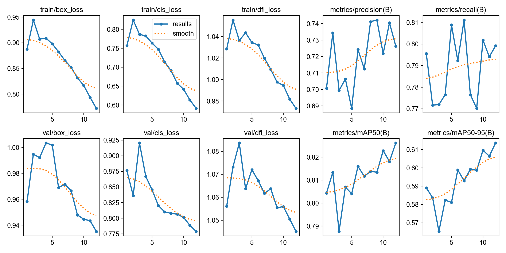
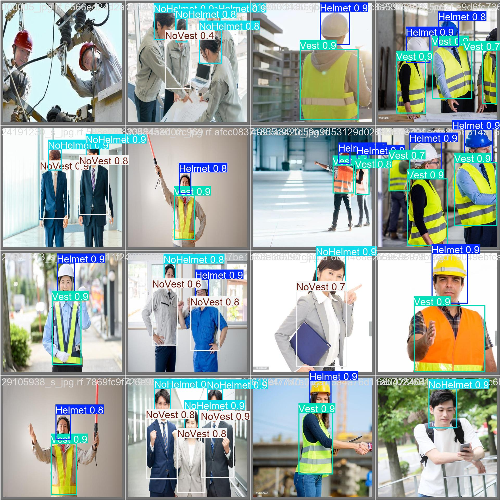

# PPE Detection with YOLOv8

基于 YOLOv8 的工地安全装备检测系统，可识别安全帽、反光背心的穿戴情况。

## 项目背景
工业场景中，工人必须佩戴安全帽和反光背心。本项目使用 YOLOv8 目标检测技术，自动识别图像中人员是否佩戴规定装备，可用于工地智能监控。

## 功能
- 检测 4 类目标：Helmet、NoHelmet、Vest、NoVest
- 数据自动清洗、完整性检查、类别平衡增强
- 支持 GPU 训练（CUDA）

## 技术栈
Python 3.11, PyTorch, YOLOv8, OpenCV, Albumentations

## 数据集
PPE Dataset（Mendeley Data），共 3212 张图片，训练集 2570 张，验证集 642 张。

## 项目结构
| 文件 | 说明 |
|------|------|
| ppe_rapid.py | 一键式全流程脚本（数据检查+增强+训练） |
| train_gpu.py | GPU 训练脚本 |
| train_only.py | 纯训练版 |
| results.png | 训练曲线图 |
| val_batch0_pred.jpg | 检测效果示例 |

## 训练步骤
1. 安装依赖：`pip install ultralytics albumentations`
2. 下载数据集并解压到指定路径
3. 运行 `python ppe_rapid.py`（全流程自动化）
4. 或分别运行 `data_check.py` → `data_augmentation.py` → `train_gpu.py`

## 训练结果
| 类别 | mAP50 | mAP50-95 |
|------|-------|----------|
| Helmet | 0.745 | 0.572 |
| NoHelmet | 0.883 | 0.683 |
| NoVest | 0.752 | 0.524 |
| Vest | 0.924 | 0.675 |
| **全局平均** | **0.826** | **0.613** |

- 训练环境：NVIDIA RTX 3050 Ti Laptop GPU, 50 epochs
- 模型权重：best.pt（约6MB）

## 作者
AI 学习者 | 2026年5月
